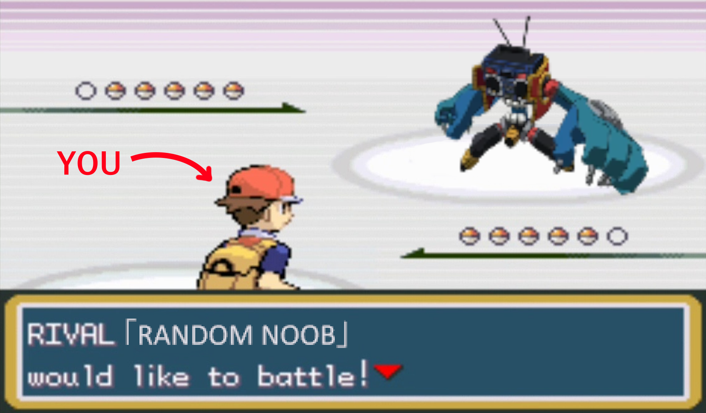

  
<b>Table of contents</b>

* TOC
{:toc}

 

<image style="border: 5px solid #cc5b0a; margin-bottom: 3px;" src="/assets/img/story/im_new.png"></image>
<figcaption style="margin-bottom: 20px; margin-left: 5px;">Slayer meets Cactos - <i>December 31, 2019 @ LL1 Stronghold</i></figcaption>

# Chapter I – Humble Beginnings 

Once upon a time, there was a player called “GrazingDeer” – GD for short. GD had picked up LLB on a whim, enticed by its funky soundtrack and wacky visuals.

The first thing he did was play through the story mode. The first few missions were a breeze – perhaps there was some hidden talent in GD? This notion quickly fell apart when he got stuck about halfway through. Still, GD kept playing, and ultimately beat the story mode.

Now richer in sparks, GD unlocked many things from the in-game shop. Still, he was short on funds and decided to follow the world-renowned guide [Economics 101](https://steamcommunity.com/sharedfiles/filedetails/?id=1553972327) to quickly gather the remaining sparks necessary to unlock everything. 

Just kidding. He jumped into quick match, since he didn’t quite feel ready for ranked mode yet. However, he immediately gave up since the only person in quick match was a dice player who wouldn’t let them touch the ball at all. Ranked mode it is.

Ranked was worse. GD was a total beginner yet kept being matched against Division 1 players. Was there no hope for GD? Would he ever get to play the game without being stomped into the ground by anyone else they could find?
A notification pops up. A friend request from a player called birkkkk. GD reluctantly accepted, half expecting the player to berate him for his lousy performance.

 
**GrazingDeer’s journey was just about to begin.**
 
 
## Unexplained Mechanics

At this point in your LLB career, there are absolutely going to be mechanics you weren't even aware of, since they aren't explaiend anywhere in-game. Here are some of the more commonly skipped over mechanics in the game.

	
Mechanics List

<table>
  <thead>
    <tr>
      <th>Term</th>
      <th>Definition</th>
      <th>Example</th>
    </tr>
  </thead>
  <tbody>
    <tr>
      <td>Pivots</td>
      <td>By pressing UP just before you turn, on the ground, you can cancel the animation and turn much faster.</td>
      <td>
        <iframe src="https://drive.google.com/file/d/1DFfAs5RRGNKeAdOAf7dhbkEy8dVM4MLQ/preview" width="210" height="160" allow="fullscreen"></iframe>
      </td>
    </tr>
    <tr>
      <td>Airturn</td>
      <td>By pressing UP and the opposite way you are facing, you are able to turn in the air.</td>
      <td>
        <iframe src="https://drive.google.com/file/d/1_hbvDjDm3TPg_Aov4Ft10DYoRZ78JYGA/preview" width="210" height="160" allow="fullscreen"></iframe>
      </td>
    </tr>
    <tr>
      <td>Floating</td>
      <td>If you just tap JUMP, you will only do a small hop. Furthermore, holding JUMP will make you float and stay airborne for much longer.</td>
      <td>
        <iframe src="https://drive.google.com/file/d/1k3u6smT8RTBhloYhzEmdfeTaB6Ky21mZ/preview" width="210" height="160" allow="fullscreen"></iframe>
      </td>
    </tr>
    <tr>
      <td>Fastfalling</td>
      <td>By pressing DOWN when you reach the apex of your jump, you are able to fall much faster (you have to release the JUMP button first, though!</td>
      <td>
        <iframe src="https://drive.google.com/file/d/1sW-UQmWI_7_mdiiDSlz5nsCJ2msJ4Zso/preview" width="210" height="160" allow="fullscreen"></iframe>
      </td>
    </tr>
    <tr>
      <td>Air Neutral</td>
      <td>If you release all directional keys before you swing in the air, you can neutral instead of smash. Alternatively, you can press UP before you swing, and this will also prevent you from smashing.</td>
      <td>
        <iframe src="https://drive.google.com/file/d/1-ykbmYUCmh8YpYj9OjegJS4LkYphv2lW/preview" width="210" height="160" allow="fullscreen"></iframe>
      </td>
    </tr>
    <tr>
      <td>Parry Extend (Pext)</td>
      <td>Parrying the ball will extend hitlag. The longer you keep the parry going, the longer the extension.</td>
      <td>
        <iframe src="https://drive.google.com/file/d/19LDpJfMbr-J6iZip8mS3Fuw234dMsQof/preview" width="210" height="160" allow="fullscreen"></iframe>
      </td>
    </tr>
    <tr>
      <td>Speed Decay</td>
      <td>Ball speed increases are lowered by consecutive hits. To reset this, either an opponent has to hit the ball, or you have to spike it.</td>
      <td>
        <iframe src="https://drive.google.com/file/d/1b8U1hRmnWHqcd9o71BK6NWvAKB2XIjjw/preview" width="210" height="160" allow="fullscreen"></iframe>
      </td>
    </tr>
    <tr>
      <td>Hitlag / Speed changes</td>
      <td>Bunts, swings, grabs, and parries will increase or decrease the ball speed by different amounts. Hitting a bunted ball will make the hitlag much shorter.</td>
      <td>
        <iframe src="https://drive.google.com/file/d/1h98a_mQ-oXTuqIGsD00g-D7mnDW9LMK-/preview" width="210" height="160" allow="fullscreen"></iframe>
      </td>
    </tr>
    <tr>
      <td>Alt. Movement / Specials</td>
      <td>Many characters have alternative specials and movement options (see the example for an overview of each one).</td>
      <td>
        <iframe src="https://drive.google.com/file/d/1xpAhPI_ZXxJQJ3BtQgn1YmnNFjiv8lOz/preview" width="210" height="160" allow="fullscreen"></iframe>
      </td>
    </tr>
  </tbody>
</table>

  

## Useful Beginner Resources

Rather than reinvent the wheel, I'm going to link a few great resources for new players, made by some legendary members of the community. Make sure to watch these, as they showcase some very important concepts and go into further detail on a few of the unexplained mechanics listed above.

 

### [Characters Move List](https://steamcommunity.com/sharedfiles/filedetails/?id=1601989295)

Finding out how characters, inputs and specials work, can be a burden. This guide, created by [Daioutzu](https://steamcommunity.com/id/Daioutzu), will help you understand the fundamental tool set of each character, including their specials.

 

### [New Player Tips](https://www.youtube.com/watch?v=N0XvggmnJl4)

There are quite a few hidden aspects and recommended settings for LLB that can be hard to uncover. This video, created by [Desselie](https://www.youtube.com/@Desselie), sheds light on some of the things the tutorial doesn't teach you.

<iframe height="360px" width="100%" src="https://www.youtube.com/embed/N0XvggmnJl4?si=naPN7zX-rAC0ZCXH" title="YouTube video player" frameborder="0" allow="accelerometer; autoplay; clipboard-write; encrypted-media; gyroscope; picture-in-picture; web-share" referrerpolicy="strict-origin-when-cross-origin" allowfullscreen></iframe>

 

### [How To Catch The Ball](https://www.youtube.com/watch?v=LmekMCWYKVs)

There are many possible ways to catch the ball, yet new players will usually catch it with a smash (the worst option). This video, created by [Kirbbbb](https://www.youtube.com/@Kirbbbbbb), shows various different ways to catch the ball instead. While some of them are too advanced, it's still useful to know them.

<iframe height="360px" width="100%" src="https://www.youtube.com/embed/LmekMCWYKVs?si=XVvYeNF7Ry7vqUrs" title="YouTube video player" frameborder="0" allow="accelerometer; autoplay; clipboard-write; encrypted-media; gyroscope; picture-in-picture; web-share" referrerpolicy="strict-origin-when-cross-origin" allowfullscreen></iframe>

 

### [LLB Dictionary](https://www.youtube.com/watch?v=N0XvggmnJl4)

Though a bit more advanced, it can still be useful to start getting acquainted with LLB jargon. This video, created by [Just_Gas](https://www.youtube.com/@justgas1903), will explain some of the more commonly used terms by the community.

<iframe height="360px" width="100%" src="https://www.youtube.com/embed/TUnWz_Nz-9k?si=zKqLi5E5arItrpIs" title="YouTube video player" frameborder="0" allow="accelerometer; autoplay; clipboard-write; encrypted-media; gyroscope; picture-in-picture; web-share" referrerpolicy="strict-origin-when-cross-origin" allowfullscreen></iframe>

  

### [LLB Angle Tool](https://antonklinger.at/llb/)

You don't actually need this tool at this point, as you will generally learn the angles by simply playing. However, if you'd like to do some offline studying, [Klianc's](https://github.com/klianc09) angle tool, an improvement on the original angle tool by [methaphist](https://github.com/metaphist), allows you to visualize angles and test out in game scenarios with as much detail as you'd like.

  

## Want some tips?

There is no experience more humbling than joining a server for the first time, asking for games, and being absolutely battered for 45 minutes by a total stranger with 100x your hours. It’s a mix of awe and total frustration. If you’re lucky, you might get a few stocks here and there, and you will feel quite proud of that. 

The other player will then try harder and prevent you from doing anything at all. A truly miserable experience.

Maybe you'll be happy, though. You can't help but wish to become good enough to be on the other side of this exchange (and get sweet revenge on this player). 

**3 more**, the other player will say, and less than 5 minutes after you'll be done. You'll say something along the lines of “you’re crazy” and “thanks for playing with me”, but just as you're about to leave, they say: **want some tips**?

When this happens, most players tend to type, “yeah sure” and listen to what the better player has to say, occasionally explaining why they were doing what they were, or otherwise excusing their bad plays. 

Don’t be like those players. 

{% include sound_text.html sound_path="'/assets/audio/dn_bg.mp3'" initial_text="What should I do then?" final_text="Wring them dry.  When the fool decides to offer you tips of their own free will, you have them trapped.  You will ask everything you do not know, pester them for every minute detail, and wring them dry of their secrets.  Until the moment they pretend they have something else to go and do, do not let them leave, and if you\'re charming, you can even deceive them into promising to review one of your recordings in the future.  Acquire all of their secrets, absorb their knowledge, and bask in the stolen experience you have taken from them." %}

Now, depending on what kind of tips you get, you might end up even more confused than before. This is normal. Not good, but normal.

Don't be afraid to ask for more specifics or examples. You might not even be aware of the things they are mentioning, and without any concrete examples, its unlikely to become clearer. 

{% include tiger_quote.html title_value="<b>Why does my favorite top player suck at giving tips?</b>" text_value=" LLB is quite an abstract game, so explaining important things can be quite difficult. On the other hand, giving very concrete tips yields diminishing returns, as there are an infinite number of different possible interactions. If I tell you how to deal with one, congratulations - You have 10000 more to figure out.
  
As such, we are required to try and generalize situations into patterns. The broader the pattern, the more useful it is. However, it also requires more knowledge to understand. As you become immersed in the world of LLB, you will start to pick on these patterns, and jargon such as 'aggro', 'interception', 'ball control'... will begin taking on a life of their own." %}

  

## Welcome to Hell

LLB is, for all intents and purposes, a discord fighter. For those not acquainted with the term, it essentially means that you will mostly be able to find games and other players by joining discord servers (usually [Stadium](https://discord.gg/Cgf7jktJ)).

Sure, you might be able to find some players on ranked once in a while, but only during peak hours, not for very long, and not with very much quality.

{% include tiger_quote.html title_value="<b>But CT, what if I want to play ranked???</b>" text_value=" Well, little buddy, you can. Presuming you can find games there, that is. Usually, the best hours to do so are during the late afternoon in north america. However, be careful. While ranked is a decent way to fight different people, it can also lead to a terrible disease: <b>ranked playstyle</b>.
  
Those afflicted by this playstyle will often learn simple tactics that work for very short sets, but aren't actually very good. Also you will rage because losing and then the other person leaving is the worst feeling ever conceived in the known universe.
  
I'm not saying not to play ranked, go ahead. Just know that you will generally learn a lot more from fighting the same person (especially better players) for long periods of time, as it allows you to adapt and understand what you are consistently failing at." %}

The relatively low playerbase, compared to some other games, means that those who are still around are most likely going to be better than you.

Much better. 10 to 100 times better. So, don't get demotivated if you lose for a while. Unfortunately, it's normal.

Now, if you're lucky and get to find some new adventurers starting out their journey at the same time as you: <a id="image_revealer"><b>for the love of god, hang unto them</b></a>.

  

It is much easier to stay motivated if you find someone of similar skill to spar with. But still, be prepared to lose horribly for the next 100 hours. Most of us went through that, you can do it too.

If it helps you, keep a list of despicable players you want to get revenge on in the future. A hit list is pretty common. I had one myself! :)

They are all dead now. 

  

## The Sins of Youth

Many a time I have seen newer players fall into the same bad habits. It's quite interesting really. 

The way new players approach this game is such a universal experience that everyone knows playing Candyman with the Liquorice skin is an telltale sign you've just started out. Despite that, people end up branching out into completely different and often innovative playstyles. It's one of the reasons this game is so beautiful.

{% include tiger_quote.html title_value="<b>AL, How come we all make the same mistakes?</b>" text_value=" Because you are an idiot.  Just kidding! We naturally tend to apply what we see is most effective against the opponent, that much is obvious. In the case of LLB, it's quite hard to do pretty much anything at all when starting out. Because of this, newer players will tend to default to the simplest things that have any percentage of success. Getting parried constantly? I'll grab it. Can't take the ball away? I'll be more aggressive.
  
The reality is that these patterns <i>are</i> in fact your best bet when it comes to winning. However, that's only because you're not proficient at the better options yet, and relying heavily on the simpler options will hurt you in the long run." %}

As such, I've ended up coining something I like to call the **3 deadly sins of new players**. I'll branch out on this idea below, adding a few other pitfalls you might end up in.

  

### Hyper-aggressiveness

Due to a lack of fundamental defensive understanding, it is very common for new players to just try and steal the ball aggressively, smashing at anything and everything without a thought.

This will work against someone who doesn't know what they are doing, but as soon as you fight against anyone who has a minimum level of ball control, you will start getting parried or mixed up (see below).

<iframe src="https://drive.google.com/file/d/1Kve7tAwiWkOhbefNaTqnOg_Cq-Ayq8L3/preview" height="360px" width="100%" allow="fullscreen"></iframe>

Instead, you should focus on learning some basic positioning and how to time your covers so as to catch the ball outside of parry range.

Sweetspots, spots where you can cover all angles safely, are the bread-and-butter of defense. These are generally in front of the opponent (though exceptions exist).

Check out [How To Be an Improver 202](https://steamcommunity.com/sharedfiles/filedetails/?id=1623252371), created by [Bitnix](https://steamcommunity.com/id/LeLnetsChosen), for more defensive examples.

  

### All-in Grabs

I am of the opinion that parry grabs are very well balanced in this game. This means that they suck.

Well, they don't suck, but they aren't that good, and if you rely on them too much you'll develop bad habits.

Parries are the backbone of competitive LLB. Without them, anyone could stand inside of your hitbox and just take the ball for free. If there was a very strong option that allowed you to grab a parry without a lot of risk, that would be the only thing people would do.

I will go in-depth on why grabs aren't that good further in this guide, but for now just trust me. it's generally better to stand further back and cover safely.

{% include tiger_quote.html title_value="<b>But Tiger, it's a mechanic in the game and I wanna use it!!!</b>" text_value=" <iframe src=\"https://drive.google.com/file/d/1SqPxDUnZjyIIVcYBTu7z0dt_ysrskvCj/preview\" height=\"360px\" width=\"100%\" allow=\"fullscreen\"></iframe>" %}

Once you've got the basics down, you can start to *think* (just think) about grabbing *a* (just one) parry. Until then, tone it down.

  

### Smash Royale

This one is a classic. New players smash, and they mix it up by smash parrying.

This is, in part, a mechanical issue. Especially for controller users, it's hard to get the muscle memory to neutral in the air, rather than smash (see [Unexplained Mechanics](#unexplained-mechanics)). 

However, it's also common to jump for everything, and end up being killed by a lawnmower (a straight angle close to the floor) because you jumped to cover with a smash.

  

Smashing is the first defensive crutch you will encounter. A crutch isn't bad, as it can help you find some decent way to cover under panic. However, charging is generally a better option, as it allows you to cover for longer, and then choose 1 of 3 angles.

  

You'll learn how to better make use of charging when you learn about **tap charges**. For now, just start getting into the habit of charging to cover when you aren't sure how to defend against a set of angles.

  

### Corner Camping

Another easy defensive crutch is corner camping. It makes it so you never have to worry about a ball hitting you from behind or positioning.

At higher levels, due to something called <a id="goblin_text" ><b>goblin tech</b></a>, there is something to be said about the usefulness of this technique. However, I don't recommend you rely on this technique when starting out, as you will be neglecting your fundamentals, and won't actually learn how to properly cover.

It's also very annoying, everyone hates it, you will be insulted, and this is probably what's going to happen anyway:

  

  

### Abandonment Issues

All the previous sins culminate in serious abandoment issues. Just like your relationship with your parents, your ex-lovers, and even your dog, you have no idea of what to do when the opponent isn't near you. 

In other words, **if they aren't being counter-aggressive, you don't have a reliable way to attack**. 

Punishing defensive and passive players can be a pretty difficult task at any level, but by avoiding the previous sins, you'll be a more balanced player, allowing you to more easily adapt in those situations.

How do you fix this? Just, make sure to practice a few setups that go beyond pressing bunt, followed by smash. For most characters, simply making use of special goes a long way.

Here is an example where I intentionally play passively to make my opponent struggle offensively. (and die at the end, totally on purpose ofc)

<iframe height="360px" width="100%" src="https://drive.google.com/file/d/1Usc9VFGo4IXd3f_wyirZS-9CJrnFz36Z/preview" title="YouTube video player" frameborder="0" allow="accelerometer; autoplay; clipboard-write; encrypted-media; gyroscope; picture-in-picture; web-share" referrerpolicy="strict-origin-when-cross-origin" allowfullscreen></iframe>

  

## Moving Forward

Finally, let's talk a little bit about what your mindset and goal should be at this point in time:

Nothing. You don't really need much right now, to be honest. 

Well, you should *want* to play, and you should *want* to improve, but that's really it. At this point in time, playing more is by far the most important thing you could do.

Everything I've written above will help expedite your journey towards improvement, and help ensure you are a more balanced player with good fundamentals, but it's not a replacement for raw experience.

Just have fun, play a bunch of people, pester them for tips, round yourself out, play in a new player tournament if you can... and you'll be a completely different player in a matter of weeks, if not days.

{% include tiger_quote.html title_value="<b>What about choosing a character, practicing tech, learning defensive techniques???</b>" text_value=" All of those are important, it's true. But they are going to be ineffective if you have to come back and do everything detailed here in 2 months time, because you were impatient and neglected your fundamentals.
  

I understand the drive to do everything right this instant, but take your time. That guy who just started, picked switch, learned how to switchflip, and constantly grabs and smash parries you? Yeah, he's going to beat you right now. But soon enough he's going to plateau and you're going to surpass him in every way." %}

Once you've mastered everything here to a reasonable degree, and have put a few hours into the game, it's time to face your next challenge: 

<b>Becoming a red belt.</b>

