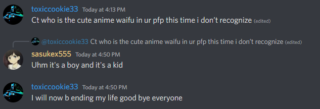
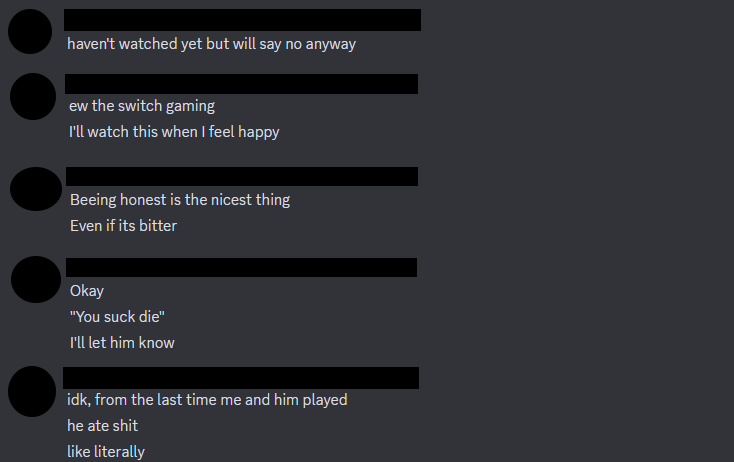
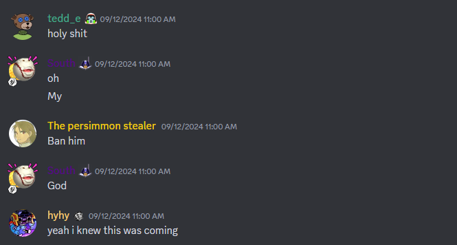
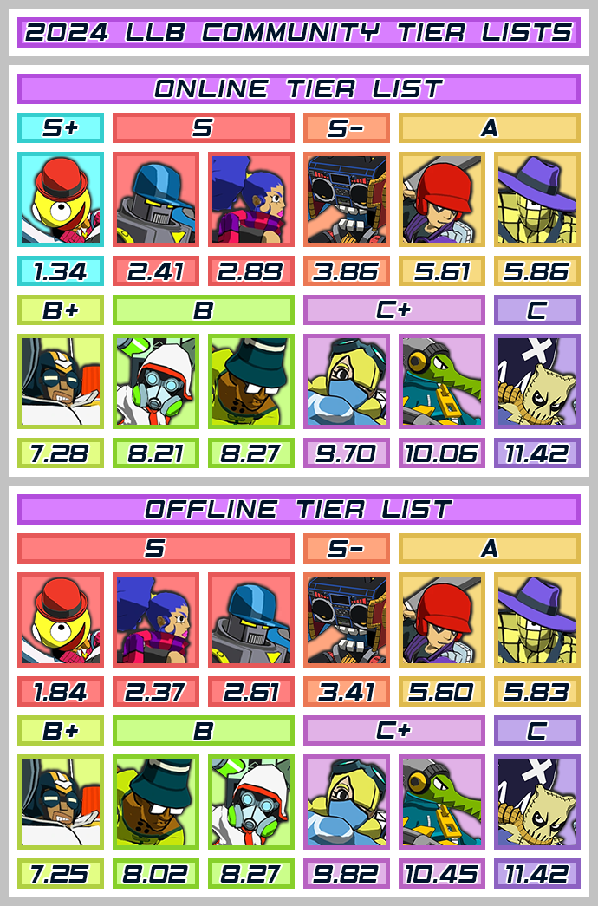
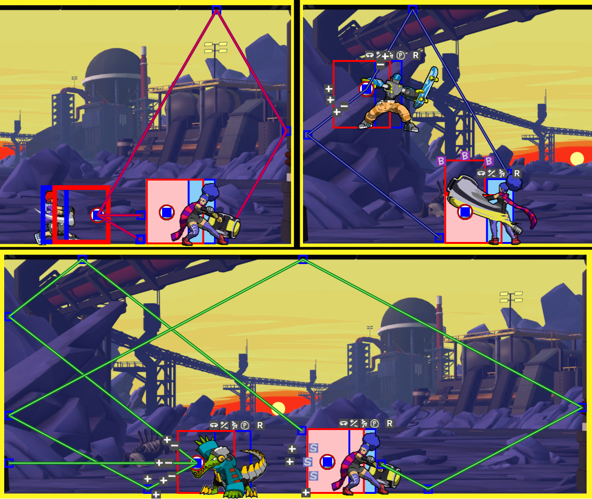
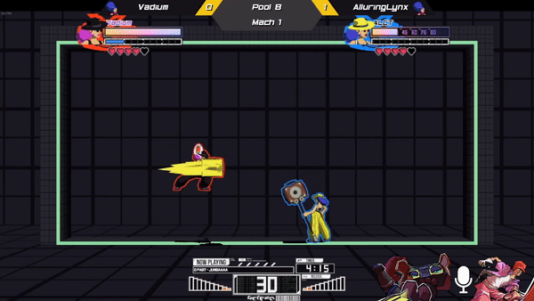

  
<b>Table of contents</b>

* TOC
{:toc}

 

<image style="border: 5px solid #cc5b0a; margin-bottom: 3px;" src="/assets/img/story/pinky_promise.png"></image>
<figcaption style="margin-bottom: 20px; margin-left: 5px;">CT and Neer make a promise - <i>March 19, 2019 @ Reptile Hideout</i></figcaption>

# Chapter II – Training Arc

About a month had passed since GrazingDeer had joined [**Stadium**](https://discord.com/invite/llbstadium), the epicenter of the LLB community. By now, he had roughly 75 hours in the game, and had attained a shiny blue belt. 

What are belts, you may ask? They are this universe's power ranking system.

| Belt Color | Requirements |
| White | None |
| Green | Reach 6th+ Division |
| Blue | Reach 4th+ Division |
| Purple | Reach 2nd+ Division |
| Red | Pass the Rooftop Exam |
| Pink | Become an Elite Warrior |
| Gold | Become a Grandmaster |
| Cyan | Become a Legend |

In truth, GD hadn't really tried to attain any specific belt until now. He merely played, and ended up reaching the requirements for blue belt. 

"*That's a bit tacky, don't you think?*" said Gromzuberg (AKA Grom), as he stared at the requirements table I wrote 2 paragraphs above. "*Why not just have fun?*"

Grom was a veteran player, but held little interest for LLB's more competitive aspects. Still, he was known as a powerful player, and an even more powerful techno-wizard.

"You're probably right..." said GD, hesijtating. In truth, he couldn't help but want to prove himself in some way. There were few things he had been good at in the past, and he felt he needed to try.

Suddenly, bentrano03, the Jackpot God, enters the room. The air becomes still.

{% include sound_text.html sound_path="'/assets/audio/villain.mp3'" initial_text="Before GD has time to blink, the menacing presence appears mere inches away from him." final_text="Before GD has time to blink, the menacing presence appears mere inches away from him.    'Out of my way, filth.'  'S-sorry...' says GD, stepping back as fast as possible.  'We have no use for more weaklings like you.' bentrano growled.  'You're not even red belt yet. I can't stand to look at you. You disgust me. Your lineage is weak, your swing baits are fake, your setups are slow, and you <b><i>keep bunting in my face</i></b>. Despicable.'" %}

Scared, GD ran away, tears streaming down his youthful eyes.

Finally, he stops. As he wipes the tears from his cheeks, GD vows to one day become strong enough to stand his ground. The first step?

**Pass the Rooftop Exam.**
 
 
## The Good, the Bad and the Ugly

If you aren't a part of the bigger LLB ecosystem, you might not be aware of what Rooftop is. Essentially, it's a matchmaking server (now a part of [Stadium](https://discord.com/invite/llbstadium)) used for matchmaking and socialization between top players. You must be a red belt or higher to gain access. 

Now, [let me be clear](https://www.youtube.com/watch?v=9pHlguBNxQk): you don't actually need to aim for Rooftop. Be it due to a dislike for the format or general lack of interest... the point is, it's simply the most common goal to shoot for. It doesn't have to be yours. 

In fact, part of the reason rooftop and the belt system was created was so new players could have some sort of goal to shoot toward. 

And why should you join rooftop? Well, besides being a clearly recognized milestone, it also allows you to matchmake with higher level players who might otherwise not want to look for games in other places, gives you access to <a id="image_revealer" style="color: #28d1a4">years of funny lore</a> and content, and also, let's be honest, red belt just sounds kinda cool.

  

{% include tiger_quote.html title_value="<b>Ehrm... but what about purple belt?</b>" text_value=" Yes, you may have noticed that I haven't spoken about purple belt.  This is because if blue is the bad belt and red belt is the good belt, purple is the ugly belt.  Unless you have a real passion for ranked mode, I would not recommend you go and grind ranked mode just to reach division 2 and get your purple belt. In my experience, those who do so tend to take twice as long to reach rooftop, and end up with terrible <b>ranked habits</b>." %}

At the time of writing this, entering rooftop requires you to pass a tryout. A tryout is like an exam, where you will play against one of the available gatekeepers. A video of the session is then uploaded for the other gatekeepers to watch and judge.

While this might seem intimidating, it can be quite useful. It ensures that you pass the loosely defined standards and criteria of top level LLB, which ensures you have at least a decent understanding of the fundamentals. 

If you pass, you can rest assured you have done well in your training. If you don't, you will receive some useful feedback anyway. Here is an example of what the gatekeeper chat usually looks like:

  

## Who do you main?

By now, you probably already have a main. However, if you don't, I highly recommend you get one.

Playing a *set* of characters is a lot harder at the start, and yields few benefits. You might think it allows you to better understand each character, and get better at universal mechanics. 

Unfortunately, as every character has distinct speeds, jump height, hitboxes, hurtboxes, specials, etc., playing multiple characters will force you to either excessively focus on or neglect certain aspects of the game. 



Here are a few useful resources if you need help choosing a character:

+ [Lethal League Blaze: Character Overview](https://www.youtube.com/watch?v=xNtcLptR4iA) [Video by [Just_Gas](https://www.youtube.com/@justgas1903)]
+ Characters Section in [Beyond Execution]()
+ [LLB Wiki](https://lethal-league.fandom.com/wiki/Characters)

I can't be bothered to deal with <a id="tier_revealer" style="color: #28d1a4">the riots</a> that will occur if I post my own personal tier list here, so I won't.

  

Instead, I will resort to the current community tier list (credit to [Hyhy](https://www.youtube.com/channel/UC-ED-6uf9KLG5RwBv_mPFvQ)):

  

## Offense 101

The first thing you want to ensure you understand adequately is ***offense***. Why offense? Because it's the first section I felt like writing.

While there is a lot of space for you to do your own thing, you can basically boil down offense into the following categories:

- Angle attacks
- Timing mixups / Frame traps
- Parry / RPS setups
- Special setups

{% include tiger_quote.html title_value="<b>Isn't this a little oversimplified?</b>" text_value=" This might seem like an exaggerated simplification, but the number of ways you can create any of the following attacks is endless.  Also, just note that some specials could fall into the previous categories. However, when you factor in specials such as pushbox, spray, bubble… it seems better to just create their own category.  If I’m missing any other base attack types, I apologize (I don't honestly also die), but I believe this accurately narrows it down." %}

### Angle Attacks

Angle attacks are the simplest and can generally be chalked down to forcing the opponent to cover on more than one side. 

It can also just be seen as a punish for the opponent's unsafe defensive approach (e.g., a [lawnmower](/chp1/#smash-royale)), or positioning (e.g., a headshot).

These might seem much too simple for higher levels, but when you turn them into fast reaction checks (i.e, sending the ball at the opponent to see if they can react in time) and apply constant pressure on the opponent, it becomes many times harder for the opponent to deal with:

  

  

### Timing mixups / Frame traps

Timing mixups / frame traps are attacks that hit the opponent during their recovery on a previous action.

For example, if they think you're going to send the ball directly at them and pre-emptively swing, they become susceptible to swing baits:

<iframe src="https://drive.google.com/file/d/1ej0JHztoSSkbhWWONTp0WH1nicTKsnJD/preview" height="360px" width="100%" allow="fullscreen"></iframe>

Swing baits are a very common attack pattern that you should become proficient in. 

Another example of a timing mixup are throw mixes. While using throw effectively is hard (but powerful!), a good example is using them to hit an opponent attempting to cover or safezone (dodge) an angle "normally":

<iframe src="https://drive.google.com/file/d/1EkaBxuK0dyd0gz62y2Wt3W0XmDgvvkQc/preview" height="360px" width="100%" allow="fullscreen"></iframe>



 

The last example you should be acquainted with are downbunt frame traps. They sometimes double down as reaction checks, but it's essentially using a downbunt to punish an opponent for parrying early, or not spacing properly:

<iframe src="https://drive.google.com/file/d/1l3lotHdX4zp-KPuUN-lS5Xibm5nbaieO/preview" height="360px" width="100%" allow="fullscreen"></iframe>

  

### Parry / RPS setups

